# reelingit

A Fullstack SPA App with Go and Vanilla JS

## Technologies

* **Backend**: Go
* **Database**: Postgres
* **Frontend**: HTML, CSS, JS
* **Communication**: JSON RESTful APIs

## Libraries

* [Air](github.com/air-verse/air) Live reload for Go apps
* [GoDotEnv](github.com/joho/godotenv) A Go (golang) port of the Ruby dotenv project (which loads env vars from a .env file).
* [PG](github.com/lib/pq) Pure Go Postgres driver for database/sql

```sh
go get github.com/joho/godotenv
go get github.com/lib/pq
go install github.com/cosmtrek/air@latest
```

## Data

* The Movie Database (TMDB)
* ~5,000 subset movies with meta data
* Images come from TMDB online server
* Video trailers from YouTube

## Features available

* See top and recent movies
* Search movies
* Movie details
* User registration
* User authentication
* Favorites movies
* Watchlist

## Architecture

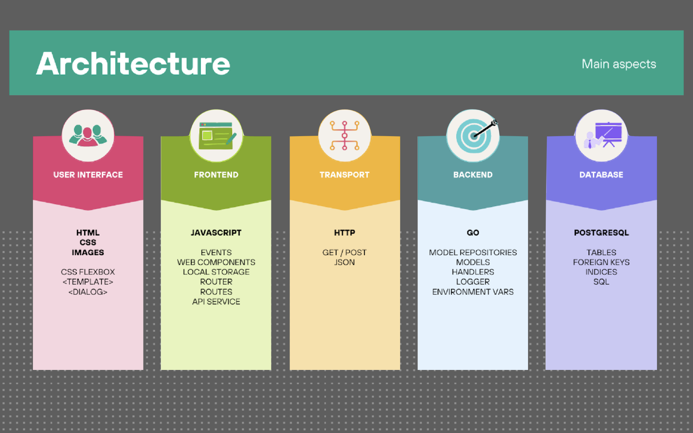
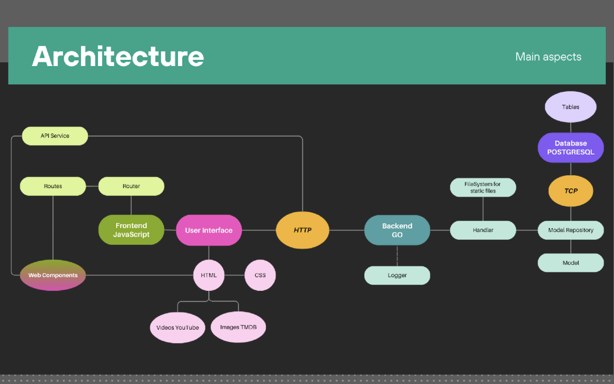
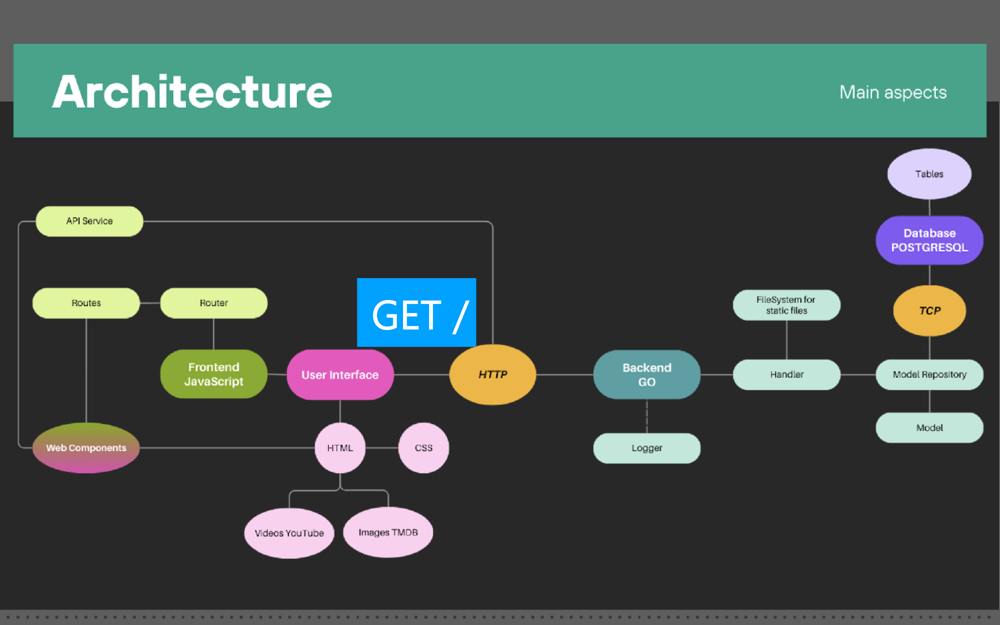
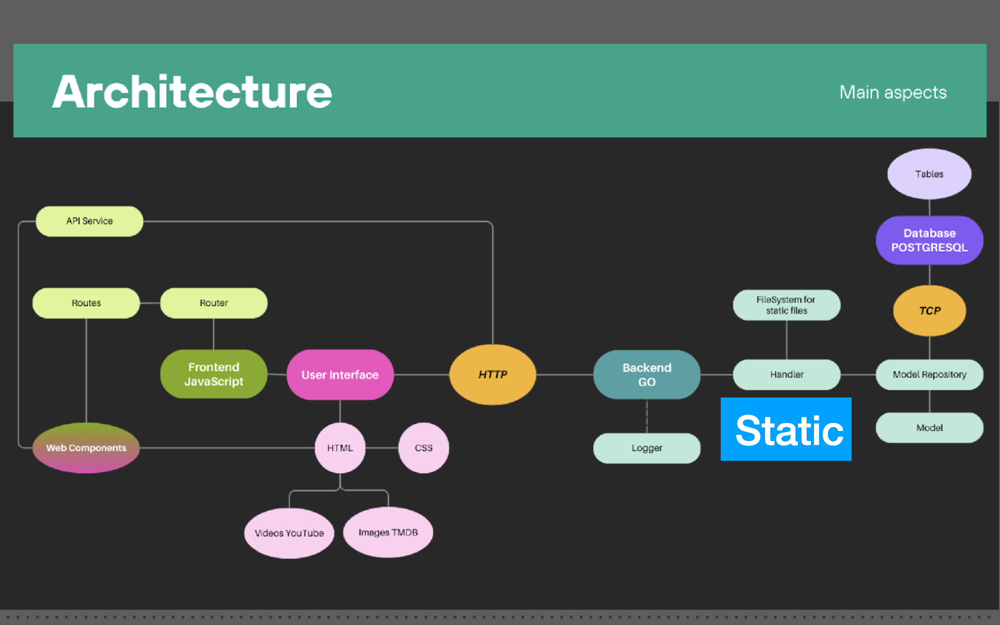
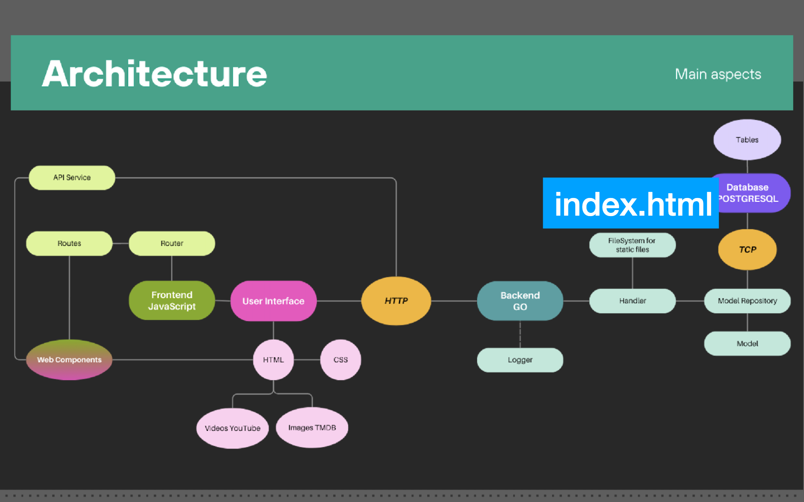
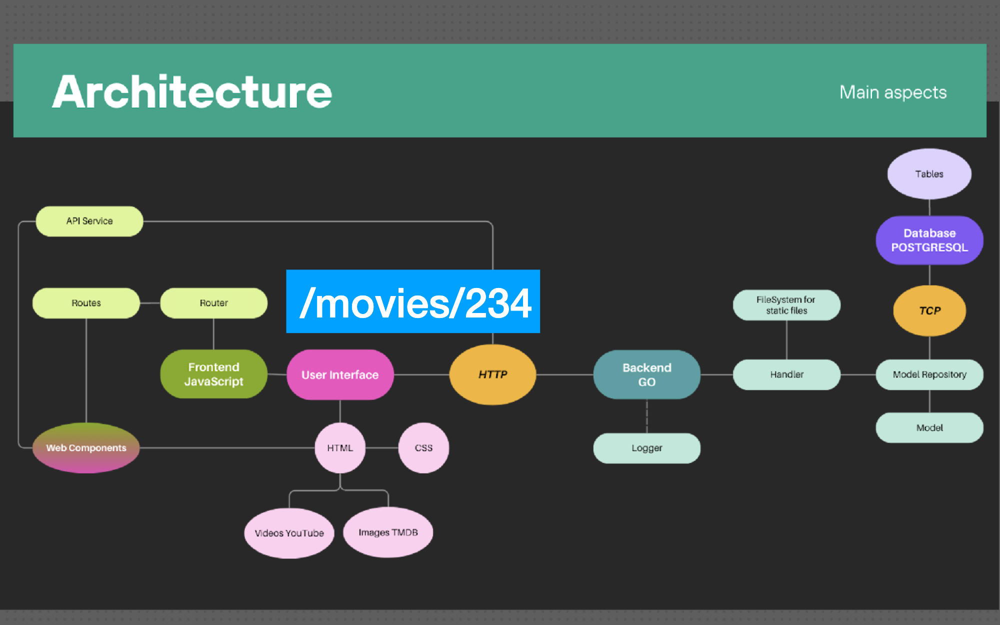
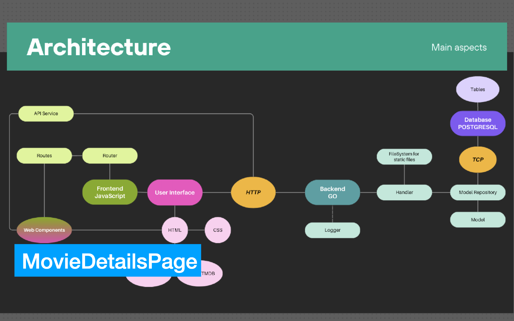
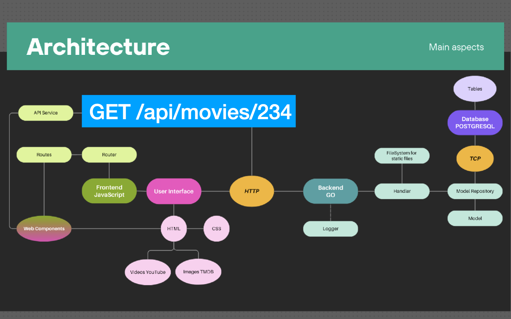
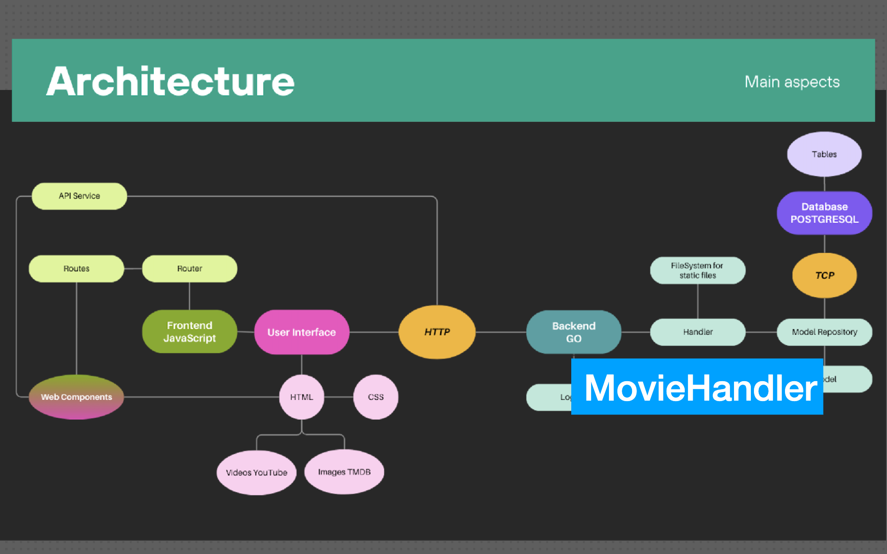
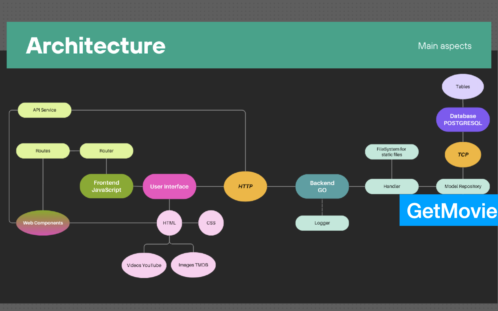
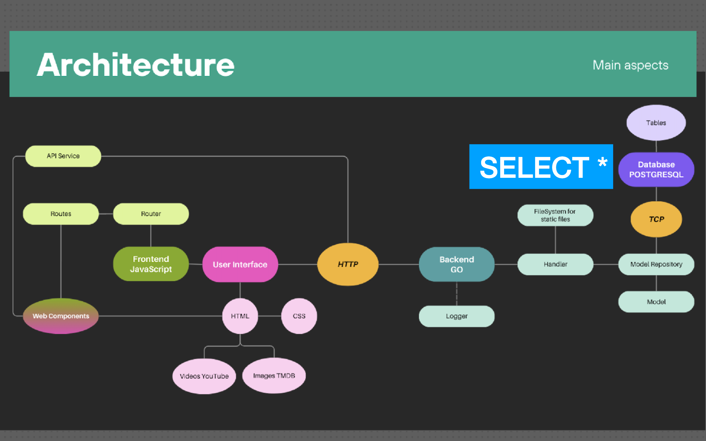
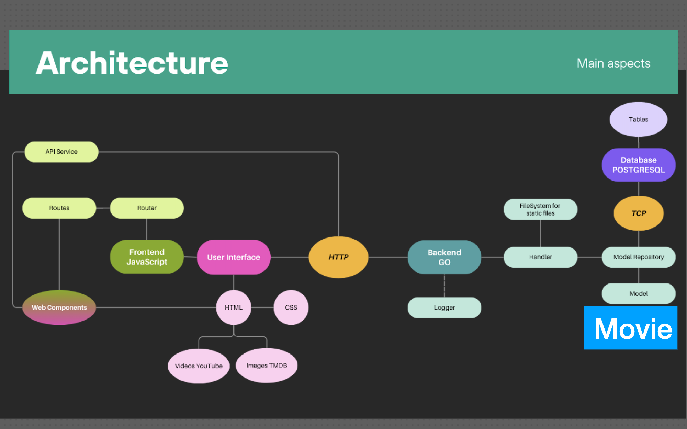
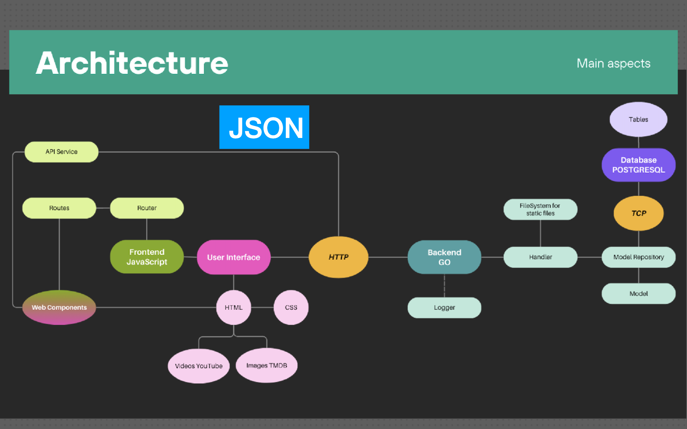
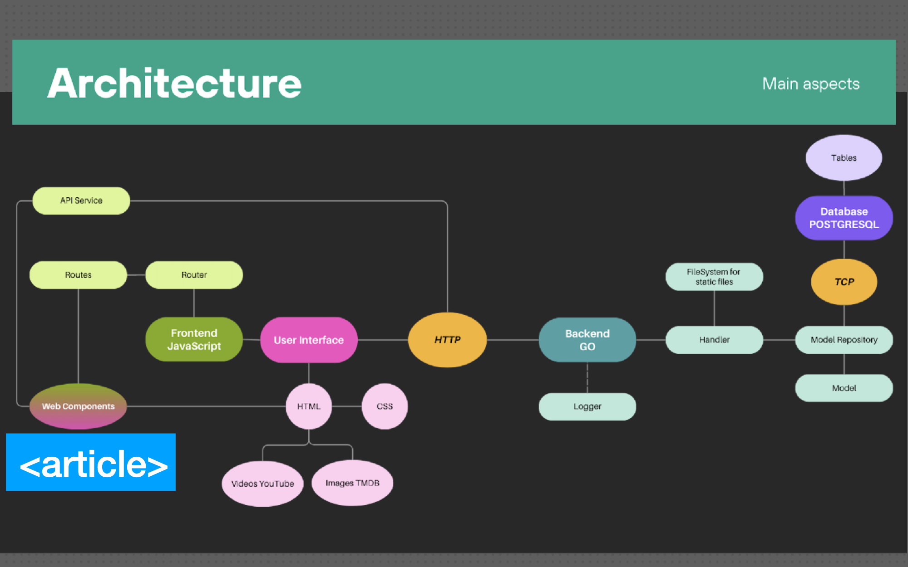

## Database Schema

### Models 

* Movie
* Genre
* Actor
* User

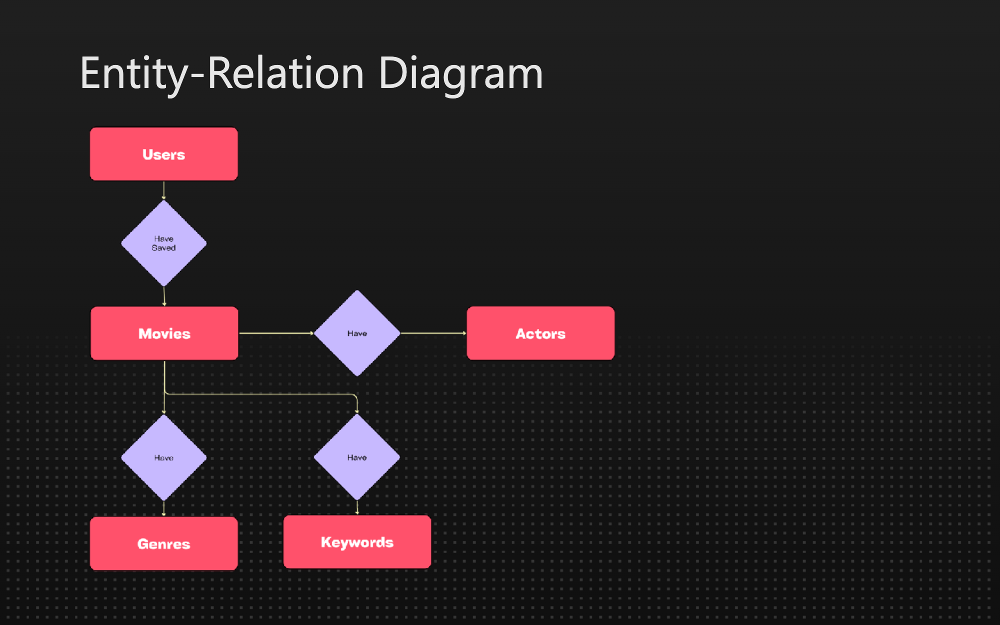
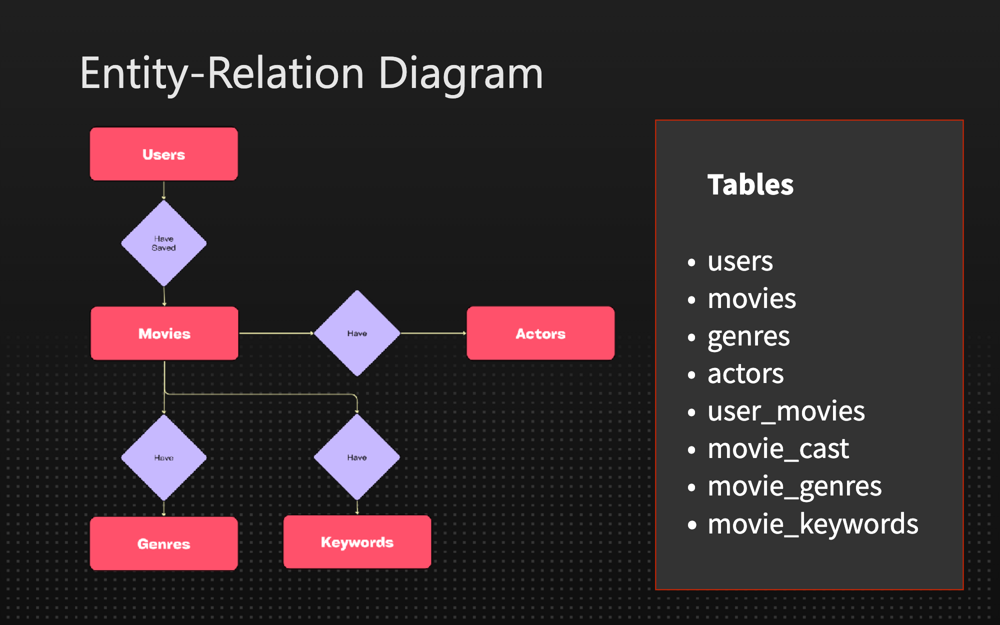
